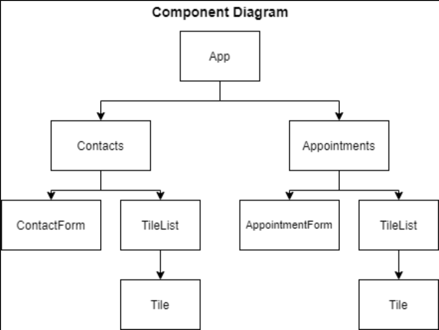

# Appointment Planner

In this project, the goal is to use functional React components to create an app that manages contacts and appointments. The app consists of two pages: one to view and add contacts and one to view and add appointments.

This project is part of the FullStack path on CodeCademy. Initial files such as CSS and HTML were provided.
